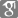

# quyinsong.github.io

<html style="font-size: 159.302px;"><head>
    <meta http-equiv="Content-Type" content="text/html; charset=UTF-8">
    <meta name="viewport" content="width=device-width, initial-scale=1.0, maximum-scale=1, minimum-scale=1">
    <title>He Wang</title>
    <link rel="stylesheet" type="text/css" href="./css/home.css">
  </head>
  <body>
    

      

        

          
Yinsong Qu

          

            
<a href="#news">News</a>

            

              <a href="#publications">Publications</a>
            

            
<a href="#awards">Awards</a>

            
<a href="#teaching">Teaching</a>

            

              <a href="#professional">Professional Service</a>
            

            

              <a href="#opportunities">Opportunities</a>
            

          

          

            

              <a href="https://quyinsong.github.io">Home</a>
            

            /
            

              <a href="https://qq.github.io">Lab</a>
            

          

        

        

          
Yinsong Qu

          <svg class="menu-phone" xmlns="http://www.w3.org/2000/svg" width="21" height="19" viewBox="0 0 21 19" fill="none">
            <path fill-rule="evenodd" clip-rule="evenodd" d="M0 1.5C0 0.671573 0.671573 0 1.5 0H19.5C20.3284 0 21 0.671573 21 1.5C21 2.32843 20.3284 3 19.5 3H1.5C0.671573 3 0 2.32843 0 1.5ZM0 9.5C0 8.67157 0.671573 8 1.5 8H19.5C20.3284 8 21 8.67157 21 9.5C21 10.3284 20.3284 11 19.5 11H1.5C0.671573 11 0 10.3284 0 9.5ZM1.5 16C0.671573 16 0 16.6716 0 17.5C0 18.3284 0.671573 19 1.5 19H19.5C20.3284 19 21 18.3284 21 17.5C21 16.6716 20.3284 16 19.5 16H1.5Z" fill="#808080"></path>
          </svg>
        

      

      

        

          

            

              
              

                
                
                
              

            

            

              
Prof.Yinsong Qu

              

                A researcher in robotics.
              

              

              

                
                
                
              

            

          

          

            <h2>Research:</h2>
            
Robot language goal navigation

            
Open-vocabulary 3D scene graph construction

            
Artificial Intelligence and Robotic Cognitive Navigation

            
Path planning and path following

            
Multi-robots cooperative control

          

        

      

      

        

          
NEWS

          <ul>
            <li></li>
            <li></li>
          </ul>
        

      

      

        

          
SELECTED PUBLICATIONS

          

            
            

              

                Adaptive neural containment maneuvering of underactuated surface vehicles 
                with prescribed performance and collision avoidance
              

              

                Yuchao Wang, Yinsong Qu, Shiquan Zhao, Huixuan Fu
                <b>He Wang†</b>
              

              
Ocean Engineering

              

                <a href="https://www.sciencedirect.com/science/article/pii/S0029801824001161?via%3Dihub" class="arXiv">paper</a>
              

            

          

          

            
            

              

                Active Fault-Tolerant Control for Path Following of Unmanned Surface Vehicle
              

              

                Yinsong Qu, Tian Xia
              

              
CAC 2022 (<b>Oral Presentation</b>)

              

                <a href="https://ieeexplore.ieee.org/document/10055129" class="arXiv">paper</a>
              

            

          

          

            
            

              

                NaVid: Video-based VLM Plans the Next Step for
                Vision-and-Language Navigation
              

              

                Jiazhao Zhang, Kunyu Wang ,Rongtao Xu* ,Gengze Zhou ,Yicong Hong
                ,Xiaomeng Fang ,Qi Wu ,Zhizheng Zhang† ,
                <b>He Wang†</b>
              

              
RSS 2024

              

                <a href="https://arxiv.org/abs/2402.15852" class="arXiv">arXiv</a>
                <a href="https://pku-epic.github.io/NaVid/" class="project">Project</a>
              

            

          

        

      

      

        

          
AWARDS

          <ul>
            <li>ICCV 2023 Best Paper Finalist</li>
            <li>ICRA 2023 Outstanding Manipulation Paper Finalist</li>
            <li></li>
          </ul>
        

      

      

        

          
TEACHING

          <ul>
            <li>
              Undergraduate course:
            </li>
            <li>
              Graduate course:
            </li>
            <li></li>
          </ul>
        

      

      

        

          
PROFESSIONAL SERVICE

          <ul>
            <li>
              Associate Editor:
            </li>
            <li>
              Area chair (AC):
            </li>
            <li>
              Program committee/reviewer:
            </li>
            <li></li>
          </ul>
        

      

      

        

          
OPPORTUNITIES

          

            ****************
          

          <ul>
            <li>
              For graduate school applicants
            </li>
            <li>
              For visiting students or research interns
            </li>
            <li>
              In Embodied AI center
            </li>
            <li></li>
          </ul>
        

      

      

        

          
        

        

          

            <a href="#news">News</a>
          

          

            <a href="#publications">Publications</a>
          

          

            <a href="#awards">Awards</a>
          

          

            <a href="#teaching">Teaching</a>
          

          

            <a href="#professional">Professional Service</a>
          

          

            <a href="#opportunities">Opportunities</a>
          

        

        

          

            <a href="https://quyinsong.github.io">Home</a>
          

          /
          

            <a href="https://quyinsong.github.io">Lab</a>
          

        

      

    

    
    
    
  

</body></html>
